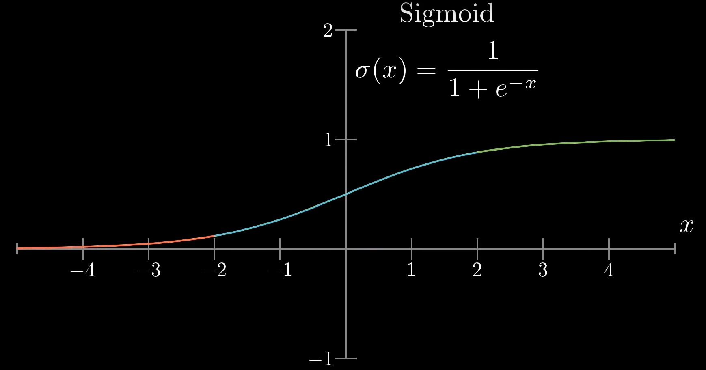

# General Introductory Notes on Neural Networks (Non-Pytorch Specific)

### [Source](https://www.youtube.com/playlist?list=PLZHQObOWTQDNU6R1_67000Dx_ZCJB-3pi)

---

## Structure

- ### Neurons
  - Neuron - A thing that holds a (floating-point) number (between 0 and 1)
    - OR a function that takes the outputs of all neurons in a previous layer and returns a number (between 0 and 1) (its activation) based on the parameters in `Weights, Biases, and Connections`
  - Ex: in an image, each pixel is a neuron, containing its (grayscale, 0-1) color value
    - These neurons make up the first layer of the network
  - Number inside a neuron called its "activation"
    - "lit up", when activation is high

- ### **Layers**
  - 3 types of Layers:
    - Input (first layer) - Input data, see above.
    - Hidden (middle layer(s)) - How the network actually does the work (i.e., how it determines a number given an image).
    - Output (last layer) - Results produced by the network. Activation value of each output neuron shows the network's confidence value for that possible output for the input.
  - Neuron activations in one layer determine the activations in the next.
    - Like biological neurons - some firing cause certain others to fire.
    - A pattern in the input causes a pattern in the next layer, which then causes another pattern in the next, etc., until the output layer, where the pattern is the confidence values.
  - Layers break things down into sub-components to detect patterns (ex: 9 -> a loop and a line, 8 -> 2 loops, etc), with each layer building on the previous (ex: previous layer could detect contours to find loops and lines)
    ![[Image]](images/hidden_layers.jpg)

- ### Parameters (Weights and Biases) and Connections
  
  - #### Weights
    
    - Numbers assigned to connections between neurons between layers
    - The activations of neurons of the connection's first layer are combined the weights (for a weighted sum), then passed on to the next neurons.
    - Can be thought of as organized into an array/tensor/grid, with each corresponding to a neuron.
    - Examples:
      - If part of some data is important, the neurons in that part might have positive weights attached to them.
      - To detect edges in a region of an image, positive weights might be attached to that region, with negative weights bordering it, so that neuron activation is highest when those edges are filled in.
    - **Normalizing weights:**
      - Sigmoid (logistic curve) function **(relatively unused, but a good example)**
        - Used to normalize weighted sums to activation values (weighted sums may be > 1 or < 0, activation values must be > 0, < 1) (one of many functions to do this)
        - Very negative inputs wind up close to 0, very positive close to 1, and everything in between increasing steadily
          
      - ReLU (widely used, supersedes Sigmoid)
        - Used to normalize weighted sums to activation values
        - Returns 0 for any value < 0, and the value if it is >0
          ![[Image]](images/relu.jpg)
        - Faster than Sigmoid, but does the same job with matching if not better quality (can replace it in all examples in this document)
  
  - #### Bias - Number (+ or -) assigned to a neuron, added to the weighted sum. Can be used to modify threshold for activation (ex: -10 sets a higher threshold for activation (more activations required in weighted sum to compensate))
  
  - Thus, the connections to one neuron from the neurons from a previous layer can be expressed as:
    
    ```
    σ(w1*a1 + w2*a2 + ...wn*an + bias)
    
    σ = sigmoid func
    wn = weight of connection to neuron n
    an = activation of neuron n
    bias = bias
    ```
    
    - This is done for every neuron in a layer, connected to all neurons in the previous layer

- A neural network can be represented as a bunch of linear algebra stuff (`σ(matrix[weights] * vector[activations] + vector[biases])`) (idk linear algebra)
- Can also be thought of as a function, which takes the input data, returns its confidence value(s), and has parameters in the form of its weights and biases

---

## Training & Learning

- ***A neural network "learns" by tweaking its weights and biases (see above) to solve the problem its given***

- ### Training and Testing Data
  
  - **Training data** - Data given to a network, for it to learn from.
    - The network is given inputs and each input's corresponding outputs (labels), and tweaks itself to get its output from the training input to match the desired output.
  
  - **Testing data** - Data similar to the training set, but not included in it, to test the network's accuracy.

- ### Cost & Cost Functions
  
  - Function to determine how bad the network is
  - The network "learning" is just it minimizing the output of its cost function
  - Adds the squares of the differences of network outputs and desired outputs
    - `cost = sum([(network_output - desired_output)**2 for network_output, desired_output in possible_outputs])`
    - (outputs = confidence values, possible_outputs = possibilities for what the network recognizes (ex: digits when recognizing handwritten digits))
  - Cost is calculated per input/network output/desired output set. 
  - Cost value is small when network classifies correctly with high confidence, but large when network is wrong or confused.
  - To determine a network's overall ability, the costs of (thousands of) individual training examples is averaged.
  - Can be thought of as a function that takes the network's weights and biases, returns the average cost, and has the parameters of the training examples.
  - #### Improving weights and biases
    - Weights and biases are random at the very start
    - Try to find the minimum of the cost function
      - Start at any input and figure out how to get lower
        - Imagine a ball rolling down a hill
        - #### 2-Dimensional Representation:
          - Take the slope of the current point; if positive, move left, if negative, move right.
            ![[Image]](images/cost_2d_graph.jpg)
            - If step sizes are proportional to slope, as slope flattens out towards minimum, steps get smaller - stops overshooting.
          - This will result in approaching a local minimum
            - **No guarantee that this local minimum will be the cost function's lowest possible value.**
        - #### 3-Dimensional Representation:
          - Inputs are x & y, output is z, creating a surface
          - Gradient of a function - which direction to step in to most increase output (steepest), take the opposite of this gradient to decrease output value.
            - Length of gradient vector indicates how steep the gradient is.
          - To find minimum (**Gradient Descent**):
            1. Compute gradient of cost function (`∇C`)
            2. Take small step in direction of the negative gradient (`-∇C`) (Neuron activation is a range instead of binary so that these small steps can be taken)
            3. Repeat
               ![[Image]](images/gradient_descent.jpg)
          - This is what the network does, just with thousands of inputs instead, through a process called **Backpropagation**
        - #### Cost function Gradient
          - The weights and biases of the network can be all placed into a single vector (array), and the gradient of the cost function produced from it, returning a vector of all the changes to be made to each weight/bias.
          - Each part of each item in the negative gradient vector tells 2 things:
            - The sign - Whether the corresponding weight/bias should be increased or decreased
            - The magnitude - How much it should be increased or decreased by
              - Greater magnitude = more importance/sensitivity (changing this weight/bias will lower the cost more than a change with a lower magnitude)

- ### Backpropagation
  - Algorithm for computing the gradient of a cost function of a neural network (these cost functions can have thousands of inputs).
  - Steps
    - For each training example:
      - Take the current output of the network for the example, and find the differences between each actual vs desired confidence value (how far the current output needs to be "nudged" to match the desired)
        - Once again, the magnitude of this difference shows how important the change is.
      1. For each neuron in the current layer and its desired change (the difference between the actual and desired outputs):
        - Its activation can be changed by manipulating 3 values:
          - Bias
          - Weights
            - Increasing the weights of connections to more active neurons increases this neuron's activities
                - Increasing the weights of connections to more active neurons has a greater effect (multiplied by stronger activation)
            - Ex: When trying to recognize a number in an image, the neurons that fire when "seeing" a 2 should be strongly connected (higher weight) to the output neuron of 2 ("thinking about 2").
          - Previous activations
            - If neurons connected with a positive weight get brighter, and those with a negative dimmer, this neuron would become more active (opposite also applies).
            - Changes in activations of neurons connected with greater (magnitude) weights have a stronger effect.
            - Neuron activations cannot be directly controlled, instead see below
      2. The desired changes to the activations of neurons in the previous layer of each neuron in the current are summed, creating a list of activation changes that need to occur in that layer.
      3. Repeat steps a, b, and c, but moving back one layer and using the desired changes determined in the above step.
    - The desired changes to the weights and biases of all the training examples are then averaged, resulting in the negative gradient, which can then be applied to the network
    - Weights and biases aren't changed until all activation changes are computed
  - #### Methods of Gradient Descent
    - **Batch**
      - All the data in the set is used for each gradient descent step.
      - *Very* computationally slow, almost never used.
    - **Stochastic**
      - Random items are selected, and the gradient descent calculated for each.
      - Requires many more iterations than batch (using only single example per step/iteration), but still faster than batch
    - **Mini-Batch**
      - Compromised between batch and stochastic, for improved speed & lower cost.
      - Training data is randomly shuffled and divided into mini-batches
      - A gradient descent step is then calculated using one mini-batch, and weights and biases changed accordingly
        - This is repeated until the (local) minimum is reached.
      - This results in more small, less accurate steps being taken, but very quickly
        - Drunk man stumbling down a hill vs a calculating man slowly making his way down and calculating each step carefully.
      - Also helps with generalization (is a weight change for something that only appears in the training data or something that is generally true?)
  

---

# Convolutional Neural Networks:
###[Source 1](https://youtu.be/9aYuQmMJvjA) | [Source 2](https://towardsdatascience.com/a-comprehensive-guide-to-convolutional-neural-networks-the-eli5-way-3bd2b1164a53) | [Source 3](https://towardsdatascience.com/convolutional-layers-vs-fully-connected-layers-364f05ab460b)
![[Image]](images/conv_diagram.jpeg)
- A convolutional network is just one with at least one convolutional layer
- Accepts 2d & 3d input - no flattening required.

- ### Convolutional Layers
  - Used for feature finding and image simplification, better at capturing "spacial and temporal dependencies" - more sophistic image recognition.
    - Applied to the input with the goal of locating features
    - Kernel - A n*n area which is shifted around, in which the network looks for features.
    - Given an input, kernel size, and stride the network will pass over the input using the kernel, finding a feature for each  area covered by the kernel ("slides across the image").
      - The kernel first repeatedly slides horizontally by `stride` pixels, and upon reaching the opposite edge, moves down `stride` pixels and back to the start of the row, and repeats.
      ![[Image]](images/conv_kernel.gif) Convolution with `kernel = (3, 3)` and `stride = 2`
        
    - This results in a tensor of different dimensions, containing the features (more numbers) that the network found and will use later
    - **Pooling**
      - Used to extract dominant features and decrease data size (and required computational power)
      - Using a kernel, combines all the features in the area of the input covered by the kernel into 1 number.
        ![[Image]](images/conv_pooling.gif) Max pooling with `kernel = (3, 3)` and `stride = 1`
      - Max pooling (most commonly used, performs better) - returns the largest number
      - Average pooling - returns the average of all features in the kernel
      - Results in an array of (the most prominent) features, to be fed into the next layer.
    - Unlike linear/fully connected layers, input and output shape and size is not fixed.
    - Each convolutional layer tends to increase channel number (n+1 dimension), while decreasing the other dimensions' sizes.
    - Using multiple convolutional layers allows for the building of features, allowing more complex recognition
        - edges & corners -> shapes -> combinations of shapes -> objects
    
  - After the Convolution layers have found features, these features can be inputted into Linear/fc layers for classification.
    - The output of the Convolutional layers usually is not in the correct format (1d array) for linear layers, and so needs to be flattened
      - The shape of this output varies depending on the input shape, which may make creating the linear layers difficult, as they have fixed input and output sizes.

- Convolution layers find things -> Linear layers recognize things

### Todo: integration with cv2 prob looks like:
- #### cv2 finds a thing -> cv2 normalizes thing (resize & grayscale) -> network determines what thing is.